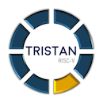
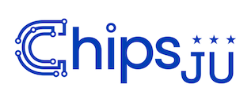
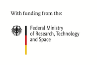

# Trace-FS

TRISTAN demonstrator `TRACE-FS`.

## License

This project is mostly licensed under the **[Solderpad Hardware License 2.1](https://solderpad.org/licenses/SHL-2.1/)**, except for the firmware, which is licensed under **[MIT License](https://mit-license.org/)**.
All files contain copyright notices and attribution.
Usage, modification, and forks are allowed as long as the license terms are followed.

## Contact

Todo: partners may put contact email address here.

## Acknowledgement

This work was developed as part of the TRISTAN project, a European Union research initiative involving 46 partners to advance the RISC-V ecosystem.
The TRISTAN project, nr. 101095947 is supported by Chips Joint Undertaking (CHIPS-JU) and its members Austria, Belgium, Bulgaria, Croatia, Cyprus, Czechia, Germany, Denmark, Estonia, Greece, Spain, Finland, France, Hungary, Ireland, Iceland, Italy, Lithuania, Luxembourg, Latvia, Malta, Netherlands, Norway, Poland, Portugal, Romania, Sweden, Slovenia, Slovakia, Turkey.
The TRISTAN project received top-up funding by the German Federal Ministry of Research, Technology and Space.
See [https://tristan-project.eu/](http://tristan-project.eu/) for more information.

