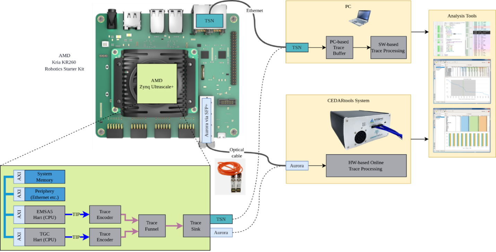

# TRISTAN Trace-FS Demonstrator

Fraunhofer IPMS, Accemic, Sysgo, Minres, Tensor, and AbsInt demonstrate the use of non-intrusive program tracing for embedded RISC-V systems in a functional safety context (compatible with ISO 26262 and IEC 61508).
The demonstrator is based on a Xilinx Kria KR260 FPGA board and includes a RISC-V subsystem in Dual-Mode-Redundancy-Lockstep configuration together with some peripherals and the novel tracing interface.
The bitstream for the FPGA contains the [EMSA5](https://www.ipms.fraunhofer.de/de/Components-and-Systems/Components-and-Systems-Data-Communication/ip-cores/RISC-V-EMSA5-IP-Cores.html) RISC-V core of Fraunhofer IPMS, the [C-Trace unit](https://github.com/accemic/c-trace) of Accemic, the [TSN tracelink](https://github.com/Fraunhofer-IPMS-DCC/Trace-Link) of Fraunhofer IPMS, and some Xilinx IP blocks.
The execution of the embedded software running on the RISC-V core is observed by the C-Trace unit via the TIP interface.
The C-Trace unit generates a Nexus-compatible data stream which encodes a program trace with timestamps.
This trace is emitted via the TSN tracelink and can be captured and stored on disk for later offline analysis, for example with AbsInt's [TimeWeaver](https://www.absint.com/timeweaver/).



## Typical Workflow

1.	The firmware (written in C) is compiled with either GCC or CompCert.
2.	The bitstream of the demonstrator system is loaded into the FPGA.
3.	The firmware binary is uploaded into the RAM of the demonstrator system.
4.	The C-Trace Unit and the TSN Tracelink are configured (e.g. concerning the included information in the trace and the target IP address).
5.	The UDP logger is started, and the demonstrator system is released from reset.
6.	While running, trace data is sent over the TSN Tracelink and captured by the UDP logger.
7.	After capturing enough trace data, the UDP logger is stopped, and the captured trace stream is saved to disk.
8.	The NEXUS stream is extracted from the UDP frames and converted to the open [CTXP format](https://github.com/accemic/c-trace-export-format).
9.	Offline trace analysis is performed using the CTXP trace file.

## Required Hardware

-	AMD Xilinx Kria KR260 Robotics Starter Kit
-	Ethernet cabling
-	Optionally Digilent PmodLED board for additional four red LEDs
-	Optionally Digilent PmodBTN board for additional four push buttons

## Repository Structure

```
├── bitstream/          The bitstream with the EMSA5 and C-Trace unit
├── doc/                Some additional documentation
├── example/            Example trace obtained for the firmware
├── firmware/           Firmware for the EMSA5 variant of the demonstrator
├── scripts/            Utility scripts
├── tools/              Helper tools
```

## License

This project is mostly licensed under the **[Solderpad Hardware License 2.1](https://solderpad.org/licenses/SHL-2.1/)**, except for the firmware, which is licensed under **[MIT License](https://mit-license.org/)**.
All files contain copyright notices and attribution.
Usage, modification, and forks are allowed as long as the license terms are followed.

## Contact
[Fraunhofer IPMS - Contact/IP Cores](https://www.ipms.fraunhofer.de/de/Components-and-Systems/Components-and-Systems-Data-Communication/ip-cores.html)


## Acknowledgement

This work was developed as part of the TRISTAN project, a European Union research initiative involving 46 partners to advance the RISC-V ecosystem.
The TRISTAN project, nr. 101095947 is supported by Chips Joint Undertaking (CHIPS-JU) and its members Austria, Belgium, Bulgaria, Croatia, Cyprus, Czechia, Germany, Denmark, Estonia, Greece, Spain, Finland, France, Hungary, Ireland, Iceland, Italy, Lithuania, Luxembourg, Latvia, Malta, Netherlands, Norway, Poland, Portugal, Romania, Sweden, Slovenia, Slovakia, Turkey.
The TRISTAN project received top-up funding by the German Federal Ministry of Research, Technology and Space.
See [https://tristan-project.eu/](http://tristan-project.eu/) for more information.


