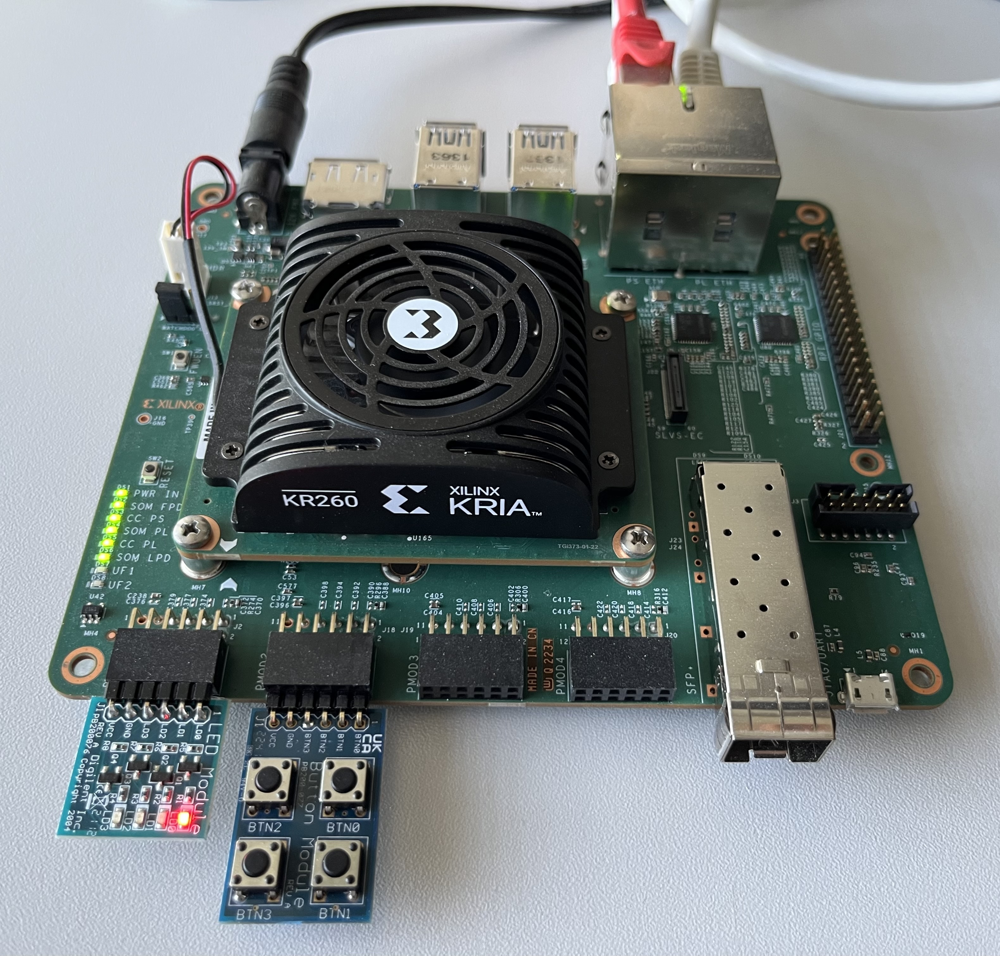

# TRISTAN Kria KR260 TRACE-FS System

## Address Map

The host APB address space is connected to `M_AXI_HPM0_FPD`.
The address range is 16 MByte.
Only the Zynq PS / Linux host system can access the APB address space.

|Address        |Width  |Module     |Description
|--             |--     |--         |--
|0xA0000000     | 16M   |APB        | KR260-MMCTL / APB host config
|   0xA0000000  |  1M   |           |   KR260-MMCTL (regs)
|   0xA0100000  |  1M   |           |   KR260-MMCTL (mapped memory, cpu0)
|   0xA0200000  |  1M   |           |   KR260-MMCTL (mapped memory, cpu1)
|   0xA0300000  |  1M   |           |   KR260-MMCTL (mapped memory, cpu2)
|   0xA0800000  | 64K   |           |   TSN-EP
|   0xA0810000  | 64K   |           |   TsnTraceBus
|   0xA0900000  |  1M   |           |   TraceUnit

The KR260-MMCTL memory address space is connected to one port of the ITCM of EMSA5.

The TRACE-FS peripherals are within a block design with an AXI4-lite interface.
The address map shall not overlap the APB address space.
This keeps the option to simply connect the Zynq PS / Linux host system if needed without changing the adresses.

|Address        |Width  |Module         |Description
|--             |--     |--             |--
|0xA1000000     | 64K   |axi_intc       |Interrupt controller (pg099)
|0xA1010000     | 64K   |axi_timer      |Xilinx Timer (pg079)
|0xA1020000     | 64K   |axi_iic        |Xilinx I2C module (pg090)
|0xA1030000     | 64K   |axi_gpio       |Xilinx GPIO (pg144)
|0xA1040000     | 32K   |axi_bram_ctrl  |Xilinx BRAM
|0xA1050000     | 64K   |axi_uartlite   |Xilinx Uartlite (pg142)

## KR260-MMCTL

Memory-mapped control of EMSA5 subsystem.

|Offset | Reset | Register      | Bits  | Field | Acc   | Description
|--     | --    | --            | --:   | --    | --    | --
|00     |       | ID            |       |       | ro    | Identification
|       | CC00  |               |31:16  | CID   |       | Fixed component ID
|       | 2412  |               |15:0   | VER   |       | Component version as BCD
|04     |       | NCPU          |       |       | rw    | CPU select
|       |       |               |1:0    |       |       | CPU number (0-3)
|08     |       | CSR           |       |       | ro    | CPU status register
|       |       |               |2      | IRQE  |       | CPU ext irq line
|       |       |               |1      | DMOD  |       | CPU debug mode
|       |       |               |0      | STBY  |       | CPU standby
|0C     |       | CCR           |       |       | rw    | CPU control register
|       |       |               |1      | BSEL  |       | CPU boot vector select
|       |       |               |0      | RSTN  |       | CPU reset (active-low)

The field CID represents CPU Control.
The field VER represents the version as BCD (year / month).

### IRQ

The peripheral block design uses the Xilinx Interrupt Controller with a single irq output signal.
The irq line is level-sensitive, active-high.
The line is connected to the external interrupt (`mip.MEIP`) of the RISC-V processor.

### GPIOs

The AXI GPIO module is connected to `PMOD_1` (Bits [7:0]) and `PMOD_2` (Bits[15:8]).

Also bits [31:30] of the GPIO output are connected to LEDs `led_ds7` and `led_ds8` on the FPGA board.
LEDs are also labeled `UF 1` and `UF 2`.

The AXI GPIO interrupt line is connected to the AXI Interrupt Controller.

### IIC

The AXI IIC module is connected to `PMOD_3`.

The IIC interrupt line is connected to the AXI Interrupt Controller.

### Timer

The AXI Timer interrupt line is connected to the AXI Interrupt Controller.

### Uartlite

The AXI Uartlite is internally loopbacked.

The AXI Uartlite interrupt line is connected to the AXI Interrupt Controller.

### PMOD

Using `PMOD_1` for GPIO output (Bits [7:0]).

Using `PMOD_2` for GPIO input (Bits[15:8]).

Using `PMOD_3` for I2C, following PMOD spec.

